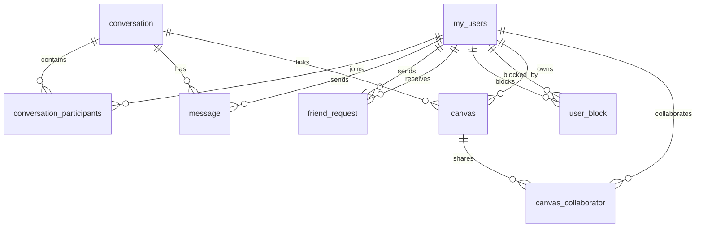

*This project has been created as part of the 42 curriculum by paulo-do, fde-jesu, filferna, brfernan, ptorrao-.*

# ft_transcendence

## Description

**ft_transcendence** is a full-stack collaborative platform inspired by Miro and Excalidraw.

It lets users:
- create and manage personal canvases,
- draw together in real time,
- chat in direct and group conversations,
- connect with friends, block users, and manage invitations,
- sign in with email/password, Google, or 42,
- enable two-factor authentication,
- monitor the stack through Prometheus and Grafana.

The project goal is to deliver a secure, real-time, containerized web application that combines social features, collaborative drawing, and observability in one workspace.

## Instructions

### Prerequisites

- `Docker` and `Docker Compose` v2
- `GNU Make`
- A modern browser with HTTPS support
- OAuth credentials for Google and 42 if you want to test those login flows

### Environment setup

1. Create a root `.env` file with the values referenced in `docker-compose.yml` and the backend:
     - `POSTGRES_USER`
     - `POSTGRES_PASSWORD`
     - `POSTGRES_DB`
     - `DATABASE_URL`
     - `JWT_SECRET`
     - `GOOGLE_CLIENT_ID`
     - `GOOGLE_CLIENT_SECRET`
     - `FORTYTWO_CLIENT_ID`
     - `FORTYTWO_CLIENT_SECRET`
     - `HOST` if you want something other than `localhost`
2. Make sure the local ports `5173`, `8081`, `5432`, `9090`, and `3000` are free.
3. If you want LAN access from another device, set `HOST` to your machine IP before starting the stack.

### Run the project

```bash
make up
```

The main services will be available at:
- Frontend: `https://localhost:5173`
- Backend: `https://localhost:8081`
- Prometheus: `https://localhost:9090`
- Grafana: `https://localhost:3000`

### Useful commands

```bash
make down
make stop
make restart
make build
make logs
make ps
make clean
make clean-certs
make clean-all
```

### Notes

- The backend starts only after PostgreSQL is healthy.
- The frontend and backend run with HTTPS using generated certificates stored in `certs/`.
- If you modify code, the stack uses volume mounts plus hot reload, so you usually do not need to rebuild immediately.

## Resources

### References

- React documentation: <https://react.dev/>
- TypeScript handbook: <https://www.typescriptlang.org/docs/>
- Express documentation: <https://expressjs.com/>
- Socket.IO documentation: <https://socket.io/docs/v4/>
- Prisma documentation: <https://www.prisma.io/docs>
- PostgreSQL documentation: <https://www.postgresql.org/docs/>
- Tailwind CSS documentation: <https://tailwindcss.com/docs>
- Docker documentation: <https://docs.docker.com/>
- Prometheus documentation: <https://prometheus.io/docs/introduction/overview/>
- Grafana documentation: <https://grafana.com/docs/>
- Google OAuth documentation: <https://developers.google.com/identity/protocols/oauth2>
- 42 API documentation: <https://api.intra.42.fr/apidoc>

### AI usage

- AI was used to reorganize and polish this README, extract a cleaner structure from the repository, and improve readability.
- AI assistance was also used to summarize features, technical choices, and deployment instructions based on the codebase.
- All repository-specific details were checked against the project files before being written here.

## Team Information

| Member | Role(s) | Responsibilities |
| --- | --- | --- |
| `paulo-do` | Product Owner | Defined priorities, validated deliverables, and led authentication and user-account features. |
| `fde-jesu` | Project Manager / Infrastructure Lead | Coordinated planning, managed the containerized stack, and handled observability and deployment. |
| `filferna` | Tech Lead | Guided architecture decisions, reviewed critical changes, and supported backend/data-model design. |
| `brfernan` | Backend Developer | Implemented user and conversation flows, API endpoints, and server-side business rules. |
| `ptorrao-` | Frontend Developer | Built the collaborative canvas UI, frontend interactions, and real-time client experience. |

## Project Management

- The team split work by domain: authentication, social features, conversations, canvas collaboration, and infrastructure.
- Progress was coordinated with regular meetings and short check-ins to unblock integration issues early.
- Code changes were reviewed through Git-based collaboration before being merged into the main branch.
- Communication happened through team meetings and repository review comments, with quick direct updates for blockers.

## Technical Stack

### Frontend

- `React 18`
- `TypeScript`
- `Vite`
- `Tailwind CSS`
- `p5.js` for canvas drawing primitives
- `Socket.IO client` for realtime collaboration

### Backend

- `Node.js`
- `Express 5`
- `TypeScript`
- `Socket.IO`
- `Prisma` ORM
- `bcrypt`, `jsonwebtoken`, `cookie-parser`, `cors`, `compression`
- `speakeasy` and `qrcode` for 2FA
- `express-rate-limit` for protection on sensitive routes

### Database

- `PostgreSQL 13`
- Chosen for relational consistency, transactional integrity, and a clean fit for users, friendships, conversations, messages, blocks, and canvas collaboration data.

### DevOps and Observability

- `Docker` and `Docker Compose`
- `Prometheus` for metrics scraping
- `Grafana` for dashboards
- HTTPS throughout the stack using generated certificates

### Justification

- `React` and `TypeScript` keep the UI maintainable while supporting a rich interaction model.
- `Express` and `Socket.IO` are a straightforward fit for REST APIs plus realtime features in one server.
- `Prisma` simplifies schema management and database access for the many relations in the project.
- `PostgreSQL` handles the project’s relational data model better than a document store.
- `Docker Compose` ensures the app is reproducible for peers and evaluators.

## Database Schema



### Main tables

- `my_users`
    - Key fields: `id`, `name`, `email`, `password`, `createdAt`, `twoFactorEnabled`, `twoFactorSecret`, `avatar`, `googleId`, `fortyTwoId`
    - Stores user identity, credentials, OAuth links, and 2FA state.
- `conversation`
    - Key fields: `id`, `type`, `name`, `created_at`
    - Stores direct and group conversations.
- `conversation_participants`
    - Key fields: `conversation_id`, `user_id`, `joinedAt`, `joined_at`, `role`
    - Links users to conversations with a composite primary key.
- `message`
    - Key fields: `id`, `conversation_id`, `sender_id`, `content`, `created_at`
    - Stores chat messages.
- `friend_request`
    - Key fields: `id`, `senderId`, `receiverId`, `status`, `createdAt`
    - Stores pending and accepted friend requests.
- `user_block`
    - Key fields: `id`, `blockerId`, `blockedId`, `createdAt`
    - Stores block relations.
- `canvas`
    - Key fields: `id`, `userId`, `name`, `content`, `createdAt`, `updatedAt`, `conversationId`
    - Stores the collaborative board metadata and serialized content.
- `canvas_collaborator`
    - Key fields: `canvasId`, `userId`, `status`, `addedAt`
    - Stores canvas invitations and collaboration status.

## Features List

| Feature | Description | Team member(s) |
| --- | --- | --- |
| Email/password authentication | Signup, login, hashed passwords, JWT sessions, protected routes | `paulo-do`, `filferna` |
| Google and 42 OAuth login | OAuth2 login, account linking, callback handling | `paulo-do` |
| Two-factor authentication | TOTP setup, QR code generation, 2FA verification flow | `paulo-do`, `filferna` |
| Profile management | Avatar updates, public profile view, private profile editing | `paulo-do`, `brfernan` |
| Friend system | Friend requests, acceptance flow, friend lists | `brfernan`, `paulo-do` |
| Block / unblock users | Prevents blocked users from interacting where required | `paulo-do`, `brfernan` |
| Direct and group conversations | Conversation list, message history, group chat support | `brfernan`, `fde-jesu` |
| Realtime chat | Message delivery, typing indicators, presence updates | `fde-jesu`, `brfernan` |
| Collaborative canvas | Multi-user drawing, tools, undo/redo, background changes | `ptorrao-` |
| Canvas collaboration | Invites, presence, cursor updates, room management | `ptorrao-`, `fde-jesu` |
| Dashboard pages | Account, friends, requests, canvases, 2FA controls | `ptorrao-`, `paulo-do` |
| Metrics and observability | `/metrics`, Prometheus scraping, Grafana dashboards | `fde-jesu` |

## Modules

The modules below are tuned to match the typical 42 evaluation categories. Each major module = 2 points, minor = 1 point. The final total is calculated per the evaluation rubric.

### Evaluation-aligned Modules

| Module Category | Implementation summary | Points |
| --- | --- | ---: |
| Web: Frontend framework (React + TypeScript) | SPA built with Vite, TypeScript, Tailwind for UI components | 1 |
| Web: Backend framework (Express + TypeScript) | REST API and controllers implemented in Express | 1 |
| Web: Real-time features (Socket.IO) | Realtime chat and canvas collaboration using Socket.IO rooms and events | 2 |
| Web: User interaction (social features) | Friends, requests, blocking, profiles, and presence | 2 |
| Web: ORM usage (Prisma) | Prisma models and migrations for relational schema | 1 |
| Web: Collaborative features (Canvas) | Shared canvas with undo/redo, drafts, cursor sync, invitations | 1 |
| Web: Reusable components / design system | Shared UI components and consistent styling with Tailwind | 1 |

**Subtotal (Web category):** 9 points

| Accessibility & Internationalization | Support for multiple languages (en/es/pt) and cross-browser support | 2 |

| User Management | Standard user management, OAuth integration (Google/42), and 2FA | 4 |

| DevOps & Observability | Docker Compose stack, Prometheus metrics and Grafana dashboards | 2 |

**Total:** `17` points

Notes:
- The subtotal mapping above follows evaluator-friendly categories: `Web`, `Accessibility & i18n`, `User Management`, and `DevOps`.
- If you prefer a different mapping (e.g., splitting the Canvas as Major instead of Minor), tell me and I will adjust the points/totals accordingly.

## Individual Contributions

### `paulo-do`

- Led authentication flows, including email/password login, Google OAuth, 42 OAuth, and 2FA setup.
- Worked on profile-related user experience, avatar handling, and account safety flows.
- Helped shape user-facing social actions such as friend requests and blocking.
- Challenge: keeping several auth flows consistent; resolved by centralizing login state and using shared backend validation paths.

### `fde-jesu`

- Managed the infrastructure layer, Docker configuration, HTTPS setup, and observability stack.
- Built and maintained the realtime socket integration and server-side room handling.
- Coordinated the backend service startup flow so the database is healthy before the API starts.
- Challenge: making local HTTPS workable for browsers; resolved with generated certificates and polling-based Socket.IO transport.

### `filferna`

- Supported backend architecture, Prisma modeling, and database relations.
- Reviewed critical changes and helped keep the codebase consistent across backend services.
- Contributed to auth/security decisions, including token handling and 2FA behavior.
- Challenge: maintaining a clean relational model for users, chats, canvases, and collaboration; resolved with explicit join tables and clear ownership rules.

### `brfernan`

- Implemented backend features around conversations, messaging, friends, and user interactions.
- Supported the public/private profile flows and social graph operations.
- Worked on server-side validation for requests, blocks, and conversation participation.
- Challenge: enforcing interaction rules across multiple features; resolved by sharing access checks across controllers and socket events.

### `ptorrao-`

- Built the collaborative canvas frontend and its drawing tools.
- Implemented the canvas UI, state handling, and collaboration controls such as invites and real-time updates.
- Worked on dashboard pages and the user-facing experience around canvas management.
- Challenge: keeping the canvas responsive while syncing many shapes and interactions; resolved by separating drawing state, history, and realtime events.

## Additional Notes

- The project runs with HTTPS in development, so browsers can connect to the frontend and backend securely.
- The canvas is limited to a small number of owned canvases per user, while collaboration is invitation-based.
- `Prometheus` and `Grafana` are included to make system health visible during development and evaluation.
- If you want to access the app from another device on your network, start it with `HOST=<your-lan-ip> make up`.